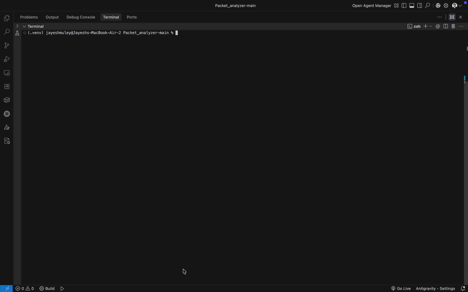

# NetSpectre - Deep Packet Inspection (DPI) Engine




NetSpectre is a high-performance network analysis tool that looks *inside* your internet traffic to identify, monitor, and block specific applications and websites in real-time.

---

## 🔍 What is Deep Packet Inspection (DPI)?

A standard firewall only looks at the **outside** of a network packet (like reading the source and destination addresses on an envelope). 

**Deep Packet Inspection (DPI)** acts like an X-ray machine. It looks at the **actual contents** of the packet payload to figure out exactly what application is generating the traffic (e.g., YouTube, Facebook, or a malicious port scan). 

Even though most web traffic is encrypted with HTTPS, the very first "Hello" message your computer sends to a server includes the website's domain name in plain text (this is called the SNI). NetSpectre reads this instantly to categorize or block the connection before any encrypted data is transmitted.

---

## ✨ Features

* **Traffic Classification:** Instantly identify apps like YouTube, Facebook, TikTok, and more.
* **Flow-Based Blocking:** Drop connections based on specific IP addresses, App types, or domain names.
* **Live Interactive Dashboard:** Stream network analytics to a web browser via WebSockets.
* **GeoIP Mapping:** Track where your traffic is going around the world.
* **TLS Fingerprinting (JA3):** Identify specific client applications based on their cryptographic signatures.
* **Intrusion Detection (IDS):** Spot anomalies like SYN floods and port scans.

---

## 🚀 Quick Start (Docker)

The absolute easiest way to try NetSpectre is using Docker. No compilation required!

```bash
# Pull the latest image
docker pull jayesh3103/netspectre-dpi

# Run the container, exposing port 8080
docker run -p 8080:8080 jayesh3103/netspectre-dpi

Once it's running, open http://localhost:8080 in your web browser to view the live dashboard.

(To analyze your own PCAP file using Docker, mount it as a volume:
`docker run -p 8080:8080 -v /path/to/capture.pcap:/app/sample.pcap jayesh3103/netspectre-dpi`)
```
---

## 🛠️ Building from Source

If you want to modify the code or run it natively, you'll need a macOS/Linux environment with a C++17 compiler (g++ or clang++), Make, and libpcap.

### 1. Compile the Project

```make all```

### 2. Run the Dashboard with a Saved Capture

```./build/dpi_dashboard --pcap mycapture.pcap --port 8080```

### 3. Run a Live Network Capture (requires sudo)

```sudo ./build/dpi_dashboard --interface en0 --port 8080```

### 4. Apply Blocking Rules

```./build/dpi_dashboard --pcap test_dpi.pcap --block-app YouTube --block-domain facebook```

---

## 🧠 Architecture at a Glance

NetSpectre is built for speed and scalability:

- **Multi-threaded Core:** Uses Load Balancer and Fast Path threads to distribute work across multiple CPU cores, allowing it to process thousands of packets per second.
- **Flow Tracking:** Maintains stateful connection tracking. Once an app is identified, it efficiently handles (or drops) all future packets for that specific flow.
- **Producer-Consumer Queues:** Utilizes thread-safe queues to move packets smoothly from the capture interface to the processing engine.

---

## 🤝 Contributing

Contributions, issues, and feature requests are welcome!

1. Fork the project.
2. Create your feature branch ```(git checkout -b feature/AmazingFeature).```
3. Commit your changes ```(git commit -m 'Add some AmazingFeature').```
4. Push to the branch ```(git push origin feature/AmazingFeature).```
5. Open a Pull Request.

---

## 📝 License

Distributed under the MIT License. See LICENSE for more information.
